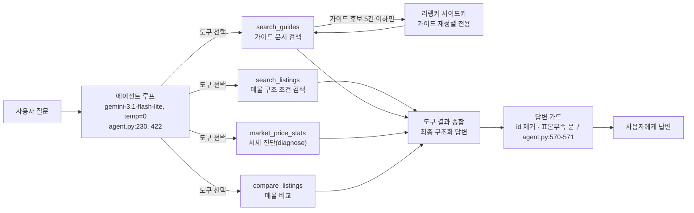

# 05. 가격 분석 파이프라인 설명 — 리랭커·적정가 예측의 입력·학습데이터·추론

> 2026-09-09 작성. 2026-09-04 최종 시연 피드백 "① 가격 분석 파이프라인을 설명하지 못했다,
> ② 가격 예측 검증이 부족하다"에 대한 답(장부 `DW-861`). 리랭커(1차로 찾은 후보를 질문과의
> 관련도로 다시 정밀하게 순위 매기는 모델)와 적정가 예측(TabPFN) 각각의 **입력·학습 데이터·
> 추론 과정** 3요소, 확률분포·5단 판정의 쉬운 설명, 실매물·챗봇 검증 결과를 한 문서에 모은다.
> 목표는 이 문서만 읽고 자기 말로 두 파이프라인을 설명할 수 있는 것이다(코드가 유일한 정본).
> 본문의 `파일:줄` 번호는 2026-09-09 수정 묶음 3(커밋 f6fdaa3) 이후 develop 기준(`market_price.py`·`agent.py`·`agent_tools.py`는 2026-09-12 DW-856·DW-873 수정 이후 기준)이며, 이후 코드가 바뀌면 8절 근거 표로 다시 대조한다.

## 0. 목적과 30초 요약

시연에서 나온 두 지적은 사실 하나로 이어진다 — 가격 분석이 "AI가 대충 감으로 말한 숫자"처럼
보였다는 것. 실제로는 사람이 정한 계산식이 아니라 (1) 관련 문서를 찾아 다시 줄 세우는
**리랭커**와 (2) 비슷한 매물로 값을 배우는 **TabPFN 적정가 예측**, 두 개의 별도 AI 부품이
정해진 입력·데이터·절차로 돌아간다. 그 셋(입력·학습 데이터·추론)을 표로 먼저 요약한다.
단, 두 부품 모두 **우리가 학습시킨 모델이 아니다** — 남이 학습을 끝낸 가중치를 받아 쓴다. 그래서
'학습 데이터' 칸에는 "누가 무엇으로 학습시켰나"를 적고, 요청마다 DB에서 뽑아 넣는 표는 **입력** 칸에 둔다.

| | 입력 | 모델과 그 학습(우리는 학습 안 함) | 추론 |
|---|---|---|---|
| **리랭커** | 질의 문장 + 가이드 문서 후보(제목·본문) 최대 5쌍 | BAAI/bge-reranker-v2-m3 — BAAI가 학습시킨 공개 다국어 리랭커 가중치를 **그대로** 사용 | 크로스인코더가 (질의, 문서) 쌍을 하나로 합쳐 넣어 관련도 점수 1개를 내고, 점수 내림차순 정렬 |
| **적정가 예측** | ① 대상 매물의 특징 11칸(연식·주행·배기량·연료 5칸·옵션수·무사고·세대 코드) ② 학습표 — 요청마다 DB에서 뽑는 비슷한 매물 최대 120행(행마다 특징 11칸 + 호가) | TabPFN v2 — Prior Labs가 **합성 데이터로 사전학습**한 가중치 파일(`tabpfn-v2-regressor.ckpt`, 약 44MB)을 그대로 사용 | 학습표로 그 자리에서 `.fit()`(가중치는 안 바뀌고 표를 정규화·저장만 함)한 뒤 대상 1건을 예측 — 값 하나가 아니라 확률 분포(mean·q10~q90)를 내고, 그 분포 안 위치로 5단 판정 |

> 학습표는 이름에 '학습'이 붙지만 모델을 학습시키지 않는다. `.fit()`에는 역전파(가중치를 고치는 계산)가
> 없어서, 학습표는 예측할 때마다 대상 매물과 **함께 모델에 넣는 입력**이다(in-context learning —
> 가중치를 바꾸지 않고 함께 준 예시를 보고 답하는 방식).

---

## 1. 전체 흐름(E2E)

사용자가 채팅으로 뭔가 물으면(예: "그랜저 시세 봐줘"), 다음 순서로 처리된다.

1. **에이전트**(`api/app/graph/agent.py`)가 질문을 받는다. 모델은 `gemini-3.1-flash-lite`
   (`api/app/config.py:38`), `temperature=0`(agent.py:225-231, 같은 상태면 같은 도구를
   고르게 하기 위한 재현성 설정)으로 LLM을 만들고, 도구 4종을 붙인다
   (`bind_tools`, agent.py:422).
2. 에이전트가 상황에 맞는 **도구**를 스스로 고른다: `search_listings`(구조 조건 검색),
   `search_guides`(구매 가이드 문서 검색), `market_price_stats`(시세 진단),
   `compare_listings`(매물 비교) — 4종 전부 `agent_tools.py:662`에 등록.
   단, 모델이 첫 응답에서 도구를 하나도 안 부르고 바로 답하려 하면 코드가 `search_guides`(원문 질의)를
   한 번 강제로 실행하고, 관련 가이드가 1건 이상이면 그 결과를 넣어 다시 답하게 한다(DW-873,
   agent.py:450-476) — 가이드 질문이 가이드 문서·리랭커를 거치지 않고 모델 자체 지식으로 새는 걸 막는다.
3. 도구가 결과를 돌려주면(여러 번 반복 가능) 에이전트가 그 결과를 근거로 최종 답을
   구조화된 형식으로 정리한다.
4. 답변이 나가기 전 **결정론 가드**(LLM이 아니라 순수 코드 필터, `answer_guards.py`)를
   한 번 더 거친다: 매물 내부 id를 답변 문장에서 지우고(`strip_listing_ids`, agent.py:570),
   비교군이 3건 미만인 시세 진단이 있는데 "표본" 언급이 없으면 주의 문구를 덧붙인다
   (`ensure_sample_caveat`, agent.py:571).

리랭커는 이 흐름 중 **딱 한 곳**, 2번의 `search_guides` 안에서만 등장한다 — 실제로
`api/app/graph/agent_tools.py` 전체에서 `rerank(`을 호출하는 곳은 578번 줄 하나뿐이다.
매물 검색(`search_listings`)이나 시세 진단에는 리랭커가 관여하지 않는다.

시세 진단(`market_price_stats`)은 매물 id 하나를 받아 `market_price.diagnose()`를
호출하고(`agent_tools.py:625`), 그 결과를 텍스트로 포맷해 에이전트에 돌려준다 —
3·4절에서 다루는 TabPFN 적정가 예측이 실제로 실행되는 지점이다.

> **▶ 데이터 형식·단위**
> - 요청은 `POST /ai/search`(`routers/ai.py:46,49`) 하나뿐이다 — 본문은 `query`(질문 문자열) + `context`(직전 대화, 최대 12턴 배열, `schemas/ai.py:51-63`). 각 턴은 `role`("user"|"assistant") · `content`(문자열) · `listing_ids`(그 턴이 보여준 매물 id 문자열 배열, 어시스턴트 턴에만 있고 최대 20개, `schemas/ai.py:33-48`)로 이뤄진다.
> - 에이전트 최종 출력(`_AgentFinalOutput`, `agent.py:217-222`)은 세 칸이다 — `answer`(답변 문자열) · `selected_listing_ids`(UUID 문자열 배열. UUID는 전 세계에서 겹치지 않게 무작위로 만드는 긴 식별자 문자열이고, DB의 `listings.id`가 실제로 이 타입이다, `supabase/migrations/0002_listings.sql:27`) · `clarify`(`{question: 문자열, chips: 문자열 배열}` 또는 없음, `schemas/ai.py:107-115`).
> - 도구가 LLM에 돌려주는 매물 한 줄 요약(`_format_listing_summary`, `agent_tools.py:266-269`) 형식: `번호. id=UUID 제조사 모델 연식년식 주행,km 가격,원 연료=… 사고=… 색상=… 지역=…` — 주행거리·가격에 천 단위 쉼표가 붙고 가격은 원 단위다(만원 아님).
> - 매물 카드(`ListingCard`, `schemas/ai.py:74-104`) 주요 필드: `price`(정수, 원) · `mileage`(정수, km) · `year`(정수, 연식) · `fuel`(문자열, 가솔린/디젤/하이브리드/전기/LPG 중 하나 또는 없음) · `accident_status`(문자열 3값: 무사고/단순교환/사고) · `options`(문자열 배열). 단, `displacement`(배기량, cc)는 이 카드엔 없다 — DB 컬럼일 뿐이고(`supabase/migrations/0002_listings.sql:15,50`) 3절 TabPFN 입력에서 DB 행을 직접 읽을 때만 쓰인다.

---

## 2. 리랭커 3요소

### 입력

질의 문장(`query_text`) + 가이드 문서 후보 (제목, 본문) 쌍 목록(`search_guides`,
`agent_tools.py:564-588`). 후보는 다음처럼 만들어진다(`find_relevant_guides_fused`,
`api/app/graph/multi_query.py:118-156`):

- 원 질의를 임베딩(문장을 숫자 벡터로 바꾸는 것)해 가이드 문서 코퍼스에서 벡터 검색
  1회(`find_relevant_guide`, `api/app/graph/doc_rag_node.py:60,76-79` — pgvector 거리
  연산자 `<=>`로 가장 가까운 top-5를 상대 게이트로 거름, `_GUIDE_TOP_K=5`).
- 질의가 길면 하위 질의로 쪼개(`decompose_query`, LLM 1회 호출) 각각도 같은 방식으로
  벡터 검색하고, 원 질의 결과(가중치 2배)와 하위 질의 결과들을 **RRF**(Reciprocal Rank
  Fusion, 순위 역수를 합산해 여러 검색 결과를 하나로 합치는 방식, `_RRF_K=60`)로 합쳐
  상위 5개를 최종 후보로 낸다(`_FUSED_RESULT_LIMIT=5`, `multi_query.py:42,46`).

> 확인 사항: 이 융합은 "벡터 검색 여러 번(원 질의+하위 질의)의 결과를 RRF로 합치는 것"이지
> 벡터+키워드(BM25 등 텍스트 일치) 하이브리드가 아니다 — `find_relevant_guide` 정의의 SQL
> (`doc_rag_node.py:76-79`)은 `embedding <=> %s::vector` 하나뿐이고 키워드 조건이 없다.

### 학습 데이터

모델은 **BAAI/bge-reranker-v2-m3**(`api/reranker_service.py:40`) — BAAI가 공개한 다국어
리랭커를 **추가 학습 없이 그대로** 가져와 쓴다. 학습 데이터 상세는 이 팀이 만든 게 아니므로
지어내지 않고, 공개 모델 카드 기준(https://huggingface.co/BAAI/bge-reranker-v2-m3)만 밝힌다.
실행 형태: `sentence-transformers`의 `CrossEncoder`로 로드하고(`reranker_service.py:35-43`),
api 본 서버와는 별도 프로세스(사이드카, 독립적으로 뜨는 보조 프로세스)로 돌린다 —
Cloud Run에 별도 배포. 이유는 모델 로드에만 11.5초가 걸려 요청마다 새로 로드하면 응답마다
그 시간이 붙기 때문(`reranker_service.py:3-16`). api 쪽은 HTTP로만 이 사이드카를 부른다
(`api/app/rerank_client.py`).

### 추론

크로스인코더(cross-encoder, 질의와 문서를 하나의 입력으로 합쳐서 넣는 모델)는 (질의, 문서)
쌍을 통째로 토크나이즈해 넣고 관련도 점수 하나를 낸다 — `pairs = [[req.query, doc.text[:2000]]
for doc in req.docs]` → `model.predict(pairs)`(`reranker_service.py:107-108`). 점수 내림차순으로
정렬해 인덱스 목록만 돌려준다(id는 사이드카 안에서 정렬용일 뿐 — `search_guides`가 넘기는
id는 실제로는 가이드 **제목**이다, `agent_tools.py:578`).

**임베딩 검색과의 차이**: 위 "입력"의 1차 후보 선정(pgvector `<=>`)은 질의와 문서를 **각자
따로** 벡터로 바꾼 뒤 그 두 벡터 사이 거리를 재는 방식이다 — 문서 쪽 벡터는 미리 계산해
저장해 둘 수 있어 빠르지만, 질의·문서가 서로 어떻게 관련되는지는 보지 않는다(벡터 거리만
본다). 크로스인코더는 질의·문서를 같이 넣어 모델이 상호작용을 직접 보고 점수를 내므로 더
정확하지만, 문서 하나당 추론을 한 번씩 해야 해서(후보 5개=추론 5회) 느리다. 그래서 "1차로
싸고 빠른 벡터 검색으로 5개까지 좁히고, 2차로 느리지만 정확한 크로스인코더로 그 5개만
재정렬"하는 2단계 구조가 나온다.

**사이드카가 죽었을 때**: `RERANKER_URL` 미설정, 연결 실패, 타임아웃(기본 3초,
`config.py:48`, 배포 환경은 `RERANKER_TIMEOUT_SECONDS`로 늘림) 어느 경우든 예외를 삼키고
`None`을 돌려준다(`rerank_client.py:29-30,49`) — `search_guides`는 `order`가 없으면 원래
벡터 검색 순서를 그대로 쓴다(`agent_tools.py:580-588`). 사이드카 모듈 자체가 없는 환경도
같은 결과가 되도록 임포트 자체를 `try/except`로 감쌌다(`agent_tools.py:44-47`). 즉 리랭커는
"있으면 개선, 없으면 원래 순서"인 선택 기능이다. 참고로 운영 배포는 2026-09-04에 연결이
확인됐다(`/rerank` 200 응답, 7.3초, 장부 DW-858 done) — 리랭커 선정 근거는
[01-model-skill-selection.md §3](01-model-skill-selection.md)에 있다.

> **▶ 데이터 형식·단위**
> - 임베딩: `gemini-embedding-001` 모델을 768차원으로 줄여 쓰고(`config.py:36,39`) 코드가 직접 L2 정규화(벡터 길이를 1로 맞추는 것)한다(`embeddings.py:1-9,19-22,56,61`). pgvector(Postgres에 벡터 검색을 더하는 확장) 컬럼은 `vector(768)`, 인덱스는 `vector_cosine_ops` — 거리 연산자 `<=>`는 코사인 거리(1−코사인 유사도, 정의상 범위 0~2, 0에 가까울수록 유사)다. 가이드 게이트 상수: `_GUIDE_TOP_K=5` · `_GUIDE_MARGIN=0.05` · `_GUIDE_DISTANCE_CEILING=0.45`(`doc_rag_node.py:39,42,47`).
> - 리랭커 요청/응답은 JSON(데이터를 `{키: 값}` 구조의 글로 주고받는 표준 형식)이다(`reranker_service.py:66-82`) — 요청 `{query: 문자열, docs: [{id: 문자열, text: 문자열}, …]}`(문서는 최대 50건 `MAX_DOCS`, 본문은 2000자에서 자름 `MAX_TEXT_CHARS`, `reranker_service.py:28-29,107`), 응답 `{scores: [{id: 문자열, score: 실수}, …]}`(점수 내림차순 정렬).
> - **점수는 원점수(logit, 모델이 마지막에 내는 가공 전 실수)가 아니라 0~1 확률형이다** — 이 모델(num_labels=1)은 활성함수 기본값이 시그모이드(값을 0~1 사이로 눌러 넣는 함수)라 `predict()`가 자동 적용한다. 이 리포에 캐시된 모델로 직접 재현: 관련 있는 예시 0.898, 무관한 예시 0.0000175(2026-09-10 로컬 재현, sentence-transformers 6.0.0).
> - 클라이언트(`rerank_client.py:22-49`)는 `POST {RERANKER_URL}/rerank`를 부르고, 타임아웃 기본 3초(`config.py:48`)이며 실패·타임아웃·URL 미설정이면 예외 없이 `None`을 돌려준다 — 반환은 인덱스 목록 또는 `None` 둘 중 하나뿐이다.
> - 예시(값은 설명용 — 실제 매물 데이터 아님): 후보 3건 제목만 있을 때 점수 [0.91, 0.02, 0.55] → 내림차순 순서 [0, 2, 1](0번이 1등, 2번이 2등, 1번이 꼴찌).

---

## 3. 적정가 예측 3요소 (`api/app/market_price.py`)

### 입력

`_tabpfn_features`(market_price.py:340-351)가 매물 1건에서 뽑는 **11칸**:

| # | 특징 | 비고 |
|---|---|---|
| 1 | 연식(year) | |
| 2 | 주행거리(mileage) | |
| 3 | 배기량(displacement) | |
| 4-8 | 연료 원핫 5칸 | 가솔린·디젤·하이브리드·전기·LPG 중 해당 칸만 1(`_fuel_onehot`, `_FUEL_ORDER`) |
| 9 | 옵션 개수(len(options)) | |
| 10 | 사고 이력 3단계(`_accident_level`: 무사고 2·단순교환 1·사고 0, accident_status가 비면 accident_free로 폴백) | 2026-09-13 DW-863 개정 — 종전엔 무사고 여부 이진(int(bool(accident_free)))이라 단순교환·사고가 같은 값이었다 |
| 11 | 용도변경 이력(`_usage_flag`: 렌트·영업용 1, 없음·미입력 0 — listings.usage_history, 0039) | 2026-09-14 DW-880 추가 — 렌트 이력 차가 같은 조건에서 약 7% 싸게 거래되는데(엔카 7,081건 회귀) 특징에 없어 +3.3% 높게 봤다; 추가 후 +2.1% |

`_tabpfn_features_with_model`(market_price.py:352-360)이 여기에 **11번째 칸**을 더한다 —
매물의 `model` 문자열(예: "더 뉴 그랜저 IG")을 이번 예측 1회 안에서만 유효한 정수로 바꾼
값이다. `TabPFNRegressor(categorical_features_indices=[10])`(market_price.py:402)로 이
칸을 범주형(순서 없는 분류값)으로 다루게 해, 연식·배기량대가 겹쳐도 세대가 다르면 가격대가
다른 것(예: 그랜저 GN7 vs 더 뉴 그랜저 IG)을 모델이 구분하게 한다(DW-854).

### 모델과 학습표 — 둘 다 '우리의 학습 데이터'가 아니다

1. **모델(TabPFN 가중치)**: Prior Labs가 표 형태 데이터(행=매물, 열=특징) 예측용으로 **합성
   데이터로 사전학습**한 모델이다. 이 모델의 학습 데이터는 Prior Labs가 만든 합성 표들이고
   우리는 그걸 보지도 바꾸지도 않는다 — 로컬 체크포인트
   `tabpfn-v2-regressor`를 그대로 불러와 CPU로 돌린다(`device="cpu"`, market_price.py:402).
   선정 근거는 [01-model-skill-selection.md §4](01-model-skill-selection.md).
2. **학습표(입력)** — 우리가 매 요청마다 만든다: `_train_rows_query`(market_price.py:444-474)가
   DB에서 뽑는다 — 조건은 판매중(`status='on_sale'`), 자기 자신 제외(`id <> %s`, leave-one-out:
   진단 대상을 학습표에서 빼는 것 — 안 빼면 자기 가격을 자기가 보고 맞히는 유출이 된다),
   같은 변속기, 기본 모델명 `ILIKE`(예: "그랜저" 포함). 정렬은 **대상과 가까운 순** —
   ① 모델 문자열 일치 ② 연료 일치 ③ 연식 차이 작은 순 ④ 주행거리 차이 작은 순
   (market_price.py:461-463), 상한 `_TABPFN_TRAIN_LIMIT=120`건(market_price.py:169,
   DW-859: 예전엔 최신순이라 대상과 무관한 표본이 섞였다). 이 학습표는 TabPFN에
   **문맥(그때그때 주는 참고 자료)으로만** 들어간다 — 사전학습된 모델이 그 표를 보고
   그 자리에서 `.fit()`(market_price.py:403)해 예측하는 것이지, 모델 가중치 자체를
   갱신하는 별도 학습 단계가 아니다.

### 추론

`_tabpfn_predict`(market_price.py:361-416)가 학습표로 `.fit()`한 뒤 대상 1건을
`predict(output_type="full", quantiles=[0.10,0.25,0.50,0.75,0.90])`(market_price.py:405-408)로
예측한다. `output_type="full"`은 값 하나가 아니라 **예측 분포**를 낸다 — 평균(mean)과
분위수(q10~q90, 4절에서 설명)를 한 번의 추론으로 같이 준다. "적정가"는 이 평균을 **만원
단위로 반올림**한 값이다(`price = int(round(float(out["mean"][0]) / 10_000)) * 10_000`,
market_price.py:409).

판정은 분위수 5단이 먼저다(`_verdict_by_quantiles`, market_price.py:295-313): q10 미만
"저렴" · q25 미만 "다소 저렴" · q75 이하 "적정" · q90 이하 "다소 높음" · 그 위 "높음". 단
두 가지 예외가 있다(`_verdict_and_basis`, market_price.py:314-335):

- **학습표가 `_TABPFN_MIN_COMPS=10`건 미만**(market_price.py:165)이면 TabPFN 예측 자체를
  안 하고(`tabpfn_quantiles=None`), 비교군(아래 사다리로 뽑은 통계용 표본)의 사분위
  (q1/q3)로 3단 판정(`_verdict`, market_price.py:282-294)으로 폴백한다.
- **비교군이 `MIN_VERDICT_SAMPLE=3`건 미만**(market_price.py:119)이면 사분위든 분위수든
  판정을 아예 매기지 않고 보류한다(`verdict_basis="표본 부족"`) — 표본 1~2건으로 "저렴/높음"
  배지를 다는 게 통계적으로 근거가 안 되기 때문.

비교군(화면 통계·사분위 폴백용, TabPFN 학습표와는 별개 쿼리)은 **완화 사다리** 6단으로
뽑는다(`LADDER`, market_price.py:55-111) — 각 단에서 5건(`MIN_SAMPLE`, market_price.py:112)
이상 모이면 멈춘다:

| 단 | 조건 |
|---|---|
| 0 | 동일 세대·연료·사고 상태, 연식 ±2년·주행 ±3만km |
| 1 | 밴드 확대: 연식 ±3년·주행 ±5만km |
| 2 | 사고 상태 조건 해제 |
| 3 | 트림 해제(동일 세대 계열) |
| 4 | 세대 해제(기본 모델명 매칭) |
| 5 | 연료 조건 해제 |

> **▶ 데이터 형식·단위**
> - 입력 12칸을 코드 순서 그대로 나열하면(`_tabpfn_features`+`_tabpfn_features_with_model`, `market_price.py:130,328-344`): ①연식(정수) ②주행거리(정수, km) ③배기량(정수, cc) ④~⑧연료 원핫(one-hot, 해당하는 한 칸만 1이고 나머지는 0인 표시법) 5칸(순서 가솔린·디젤·하이브리드·전기·LPG) ⑨옵션 개수(정수) ⑩사고 이력 3단계(무사고 2·단순교환 1·사고 0, 2026-09-13 개정) ⑪용도변경 이력(렌트·영업용 1, 아니면 0, 2026-09-14 DW-880) ⑫세대(model) 범주 코드(이번 예측 1회 안에서만 유효한 정수). G-1 매물(그랜저 GN7 하이브리드 2024년식·23,987km·무사고·옵션 2개, `04-demo-cases.md:107-115`)로 채우면 `[2024, 23987, 1598, 0,0,1,0,0, 2, 2, 0, 세대코드]` — 하이브리드라 원핫 3번째 칸(index 2)만 1이다(배기량 1,598cc는 운영 시드의 그 매물 행에서 읽었고, 이 벡터는 2026-09-13에 개정된 `_tabpfn_features`를 실제로 실행해 얻은 값이다(10번째 칸 무사고=2, 11번째 칸 이력 없음=0)).
> - 학습표: 행=매물(최대 120건, `_TABPFN_TRAIN_LIMIT`), 열=위 11칸, 정답값 `y`는 매물의 `price`를 가공 없이 그대로 쓴다(원 단위 정수, `market_price.py:396-397`). 형태로 보면 특징 `x`는 n행×11열, `y`는 길이 n인 1차원 목록, 대상은 1행×11열이다(코드는 파이썬 리스트를 그대로 넘기고 TabPFN 내부에서 배열로 바뀐다 — 명시적 numpy 변환 코드는 없음).
> - 출력: `predict(output_type="full", quantiles=[.10,.25,.50,.75,.90])`가 돌려주는 결과에서 코드가 실제로 읽는 키는 `mean`과 `quantiles` 둘뿐이다(`market_price.py:173-174,393-405`). `mean`(원 단위 실수)을 10,000으로 나눠 반올림한 뒤 다시 10,000을 곱해 `price`로 쓴다 — 값은 여전히 원 단위 정수이고 1만원 배수로만 반올림된 것이다(예: 40,337,256 → 40,340,000). `quantiles`는 `q10`~`q90` 다섯 키, 각각 원 단위 정수(이쪽은 반올림만 하고 1만원 배수로 맞추지 않음).
> - `diagnose()` 반환 dict(`market_price.py:545-558`): `listing`(매물 요약, `market_price.py:417-431`) · `criteria`(비교군 사다리 단계·설명·건수) · `stats`(비교군 min/q1/median/q3/max, 원 단위 정수 또는 None) · `percentile`(**0~1 사이 소수다 — 0~100이 아니다**, `market_price.py:263-271`) · `verdict`(5단 또는 3단 문자열 또는 None) · `verdict_basis`("분위수"|"사분위"|"표본 부족") · `tabpfn`(`{price, note, quantiles}`) · `comps`(비교 매물 목록, 각 `{id, model, year, mileage, price}`, `market_price.py:434-441`). 이 dict 형태를 강제하는 별도 pydantic 응답 모델은 없다 — API 응답에서는 그냥 `dict | None`으로만 선언돼 있다(`schemas/ai.py:129,134`).
> - 챗봇 텍스트(`_format_market_diagnosis`, `agent_tools.py:591-616`)는 가격을 전부 원 단위로만 쓴다("만원"으로 바꾸지 않음) — `percentile`을 표시할 때만 ×100 해서 "하위 22%" 식으로 보여준다(`agent_tools.py:600-601`). 화면(웹)에서 보이는 "○○만원" 표기는 별도 함수가 한다 — `formatPrice`/`formatStatPrice`(`web/src/lib/price.ts:26-31,42-45`, 예: 41,120,000원 → "4,112만원"). DB·입력폼은 항상 원 단위 그대로다(`web/src/lib/constants.ts:47-56`).
> - 소요 시간(CPU, 로컬 PC 실측): 학습표 53행 1.6초 · 120행(상한) 8.3초 · 200행 18.5초 · 284행 39.5초 — 행이 늘수록 시간이 거의 제곱으로 는다(`deferred-work.md:7029`, DW-852).
> - 흐름 한 벌(G-1, 2026-09-10 현재 엔진 커밋 f6fdaa3으로 운영 시드를 읽기 전용으로 실행한 값, 소요 5.3초): 입력 행(2024년식·23,987km·1,598cc·하이브리드·무사고·옵션 2개·호가 38,040,000원) → 특징 벡터 `[2024, 23987, 1598, 0,0,1,0,0, 2, 2, 0, 세대코드]` → 학습표 47행(`tabpfn.note`="기본 모델군 47건 학습") → `diagnose()` 출력: `tabpfn.price`=39,880,000원(mean을 만원 배수로 반올림) · `tabpfn.quantiles`={q10: 38,409,008, q25: 39,153,096, q50: 39,892,220, q75: 40,627,288, q90: 41,332,508}(원) · `criteria`={step: 0, sample_count: 9} · `stats`={min: 36,650,000, q1: 38,080,000, median: 38,500,000, q3: 40,050,000, max: 42,650,000}(원) · `percentile`=0.222 · `verdict`="저렴"(`verdict_basis`="분위수") → 챗봇 문구는 원 단위 그대로, 웹 카드는 "적정가 3,988만원"으로 표시. 참고: 04 문서 시점(09-03 엔진, 세대 특징 없음)에는 같은 매물이 적정가 4,034만원·q10 3,893만원이었다(`04-demo-cases.md:112`) — 3절 "같은 조건인데…" 소절이 말하는 변화가 이 차이다.

### 같은 조건인데 왜 적정가가 같게 나왔나

2026-09-04 시연에서 지적된 사례: 그랜저 GN7 하이브리드 2024년식·23,987km·무사고·호가
3,804만원(`04-demo-cases.md:107-115`, id `b7f4a6fc`)과 2025년식·6,593km·무사고·호가
4,265만원(`04-demo-cases.md:128-136`, id `1049a205`) 두 매물이 같은 "적정가" 4,030만원을
받았다. 코드 결함이 아니라 세 가지가 겹친 결과다(DW-857, `deferred-work.md:7070-7078`):

1. **원 단위 값은 실제로 달랐다**(로컬 재계산 40,337,256원 대 40,341,036원) — 다만 둘 다
   만원 단위로 반올림하면 4,030만원으로 같아졌다.
2. **연식 효과가 이 학습표 안에서 과소평가됐다** — 이 두 매물이 뽑힌 학습표에서 모델은
   연식 1년 차이를 약 2%로만 벌렸는데, 시드 데이터를 만든 규칙상 진짜 정답 차이는
   5.7%(연식 220만원+주행 17만원)였다.
3. **자기 제외(leave-one-out)가 두 매물을 반대 방향으로 밀었다** — 2025년식 매물은 자기
   또래(2025년식) 중 가장 비싼 축이라, 자기를 뺀 학습표로 예측하면 값이 낮아진다. 2024년식
   매물은 반대로 자기 또래 중 가장 싼 축이라 자기를 빼면 값이 높아진다. 이 두 반대 방향
   보정이 (이미 작았던) 연식 격차를 거의 지워버렸다.

세대 범주 특징(11번째 칸)을 추가한 뒤(DW-854, 커밋 `ba4b8c3`) 두 매물의 예측은
3,988만원(저렴)/4,029만원(높음)으로 갈라졌다(`deferred-work.md:7050`, DW-854 resolution). 자기 제외 자체는
없애면 안 되는 필수 장치다 — 없애면 모델이 정답(자기 가격)을 보고 자기를 맞히는 유출이
된다(출처: 메모리 노트 `demo-feedback-2026-09-04-plan.md`).

---

## 4. 확률 분포와 5단 판정을 쉽게

`predict(output_type="full")`이 내는 건 숫자 하나가 아니라, 가격 축 위에서 "이 조건의 차가
얼마일 것 같은가"를 여러 지점(q10~q90)으로 표현한 분포다. **q10 = 학습표 기준으로 이 특징
조합의 차 가격이 그 값 아래일 확률이 10%라는 뜻의 값**이다. 실제 매물 가격이 이 분포의
어디에 있는지로 5단 배지를 매긴다 — 배지 이름·경계값은 [04-demo-cases.md §0](04-demo-cases.md)에
이미 정리돼 있으므로 여기서 반복하지 않는다.

분포의 폭(예: q75−q25)이 넓다는 건 **학습표에 뽑힌 이웃 매물들의 실제 가격이 서로 많이
흩어져 있다**는 뜻이다 — "비슷한 조건인데 가격이 들쭉날쭉해서 모델이 자신 없다"는 신호로
읽으면 된다. 폭은 사람이 정하지 않고 그 매물의 이웃 분포에서 그대로 나온다(3절 참조).

판정 보류(`verdict_basis="표본 부족"`)가 나오는 조건은 분포 폭과는 별개다 — 비교군(사다리로
뽑은, 화면 통계용 표본)이 3건 미만이면 분포가 있든 없든 아예 판정을 매기지 않는다
(market_price.py:119,307-328). 즉 "폭이 넓다"는 모델이 자신 없다는 신호이고, "판정 보류"는
애초에 비교할 매물 자체가 너무 적다는 신호다 — 서로 다른 문제다.

> **▶ 데이터 형식·단위**
> - G-1(그랜저 GN7 하이브리드 2024년식·23,987km·호가 38,040,000원)의 다섯 지점(2026-09-10 현재 엔진 실행값, 원): q10 38,409,008 · q25 39,153,096 · q50 39,892,220 · q75 40,627,288 · q90 41,332,508. 가운데 절반 폭(q75−q25)=1,474,192원으로 q50의 3.7%. 호가 38,040,000 < q10 38,409,008이므로 "저렴". 04 문서 시점 값(q10 3,893만원, 폭 3.5%, `04-demo-cases.md:110,112`)과 비교하면 세대 특징을 넣은 뒤 분포 전체가 조금 아래로 내려왔다.
> - 판정 규칙을 숫자로 보면: G-1 호가 3,804만원 < q10 3,841만원(2026-09-10 실행값) → "저렴" 배지(경계값 이름 전체는 `04-demo-cases.md` §0 참조). 폭이 넓을수록 이웃 매물 가격이 들쭉날쭉하다는 뜻이고, G-1처럼 좁으면(3.7%) 작은 차이로도 등급이 갈린다.

---

## 5. 검증 요약

### (a) 실매물 300건 검증

데이터: 엔카 실매물 15세대 7,081건(2026-09-05 수집, 비상업·평가용, 호가 기준, 레포 밖
`.logs/`에 보관)에서 세대별 20건씩 300건(`.logs/encar_eval/20260905/report.md` §8.1).
제품 코드의 `diagnose()`를 그대로 호출했다.

| 지표 | 값 | 기대(설계) |
|---|---|---|
| TabPFN 오차율 중앙값(MdAPE) | 5.8% | — |
| ±10% 이내 적중률 | 70% | — |
| ±20% 이내 적중률 | 94% | — |
| q10~q90 구간 적중률 | 84.3% | 80% |
| 판정 분포(저렴/다소저렴/적정/다소높음/높음) | 7.7 / 15.3 / 54.3 / 14.7 / 8.0 % | 10 / 15 / 50 / 15 / 10 % |
| LOO 대 hold-out 예측 차이 | 평균 0.9% | — |
| LOO 대 hold-out 판정 일치율 | 93.3% | — |
| 기준선 — 비교군 중앙값 | 오차율 중앙값 7.8% · ±10% 60% | TabPFN보다 낮은 정확도 |
| 기준선 — 세대별 회귀 | 오차율 중앙값 7.1% · ±10% 62% | TabPFN보다 낮은 정확도 |
| 사고 매물 오차율 중앙값 | 10.4%(사고 41건; 단순교환 95건은 5.3%로 무사고 수준) | 무사고(5.2%)의 약 2배 — 6절 DW-863. 2026-09-13 3단계 특징 채택 후 같은 300건에서 9.7% |
| 1,500만원 미만 오차율 중앙값 | 7.9% | 저가대일수록 %가 커짐 |
| 부트스트랩 95% 신뢰구간(2,000회 재추출) | 오차율 중앙값 5.1~7.0% · ±10% 적중률 64.7~74.7% · q10~q90 적중 80.0~88.3% | 표본 300건에서 숫자가 흔들릴 수 있는 폭 |
| 사람 판정 50건 대조(5단) | 정확 일치 52% · 한 칸 이내 90% · 3단으로 접으면 62% | 사람이 엔진보다 싸다고 본 쪽이 16건 대 8건 — 렌트·영업 이력 특징 부재 가설, DW-864에서 확인 |

> 부트스트랩(같은 300건에서 무작위로 300건을 다시 뽑는 일을 2,000번 반복해, 지표가 표본
> 운에 따라 얼마나 흔들리는지 재는 방법)은 처음 검증 때 파일로 남기지 않아 2026-09-09에
> 다시 계산해 `eval/bootstrap.json`으로 저장했다(seed 고정, 95% 백분위 구간).

LOO(leave-one-out, 대상 1건만 빼고 나머지 전부를 후보로 씀)와 hold-out(검증 300건 전부를
판매완료로 돌려 서로의 표에서 빼는, 더 엄격한 방식) 두 방식 모두 비슷한 결과였다 — 표본이
수백 건이면 이웃 매물 1건의 유무가 결과를 크게 흔들지 않는다는 뜻이다.

### (a′) 실매물 955건 재검증 (2026-09-13, DW-864)

같은 7,081건에서 300건에 쓰지 않은 매물만으로 새 표본을 뽑았다(세대당 최대 67건, 작은 두 세대는
전부 — 총 955건, seed 20260913). 사고 특징 3단계(DW-863) 적용 전 코드와 후 코드로 같은 955건을
각각 돌렸다(`.logs/encar_eval/20260913_i/summary.md`). 300건 수치는 이 표본의 95% 구간 밖(다소 쉬운 표본)이었다. **포트폴리오·시연에 쓰는 대표 수치는
2026-09-14 용도변경 이력 특징(DW-880)까지 더한 현 코드의 값이다: MdAPE 6.8%(95% 6.2~7.2) · ±10% 69.0%(66.0~72.0) ·
±20% 93.5% · q10~q90 82.8% · 렌트 이력 차 편향 +3.3→+2.1%(예측>실제 64→59%) · 사고 8.7 / 단순교환 7.0 / 무사고 6.3%.**
아래 표의 3단계 열은 그 직전 상태(이력 특징 없음)다.

| 지표 | 3단계(현 코드) | 개정 전 | 300건(09-05) |
|---|---|---|---|
| TabPFN 오차율 중앙값(MdAPE) | **6.6%** (95% 구간 6.1~7.1) | 6.7% | 5.8% |
| ±10% 이내 적중률 | **69%** (65.9~71.8) | 68% | 70% |
| ±20% 이내 적중률 | **93%** | 94% | 94% |
| q10~q90 구간 적중률 | 82.7% | 82.8% | 84.3% |
| 판정 분포(저렴/다소저렴/적정/다소높음/높음) | 8 / 17 / 53 / 12 / 9 % | 9 / 17 / 54 / 12 / 9 % | 8 / 15 / 54 / 15 / 8 % |
| 사고 상태별 MdAPE(무사고 504 / 단순교환 322 / 사고 129) | 6.3 / 6.6 / **8.1** | 6.4 / 6.2 / 9.8 | 5.2 / 5.3 / 10.4 |
| 3단계 전후 개선·악화 건수 | 사고 82·45, 단순교환 141·176, 무사고 250·238 | — | 사고 34·7 |
| 판정 일치율(전후) | 87.1% | — | 89.7% |
| 세대별 MdAPE 범위(15세대, 67건씩) | 4.9(그랜저 GN7 HEV) ~ 10.0(아반떼 AD FL) | 5.1 ~ 11.3 | 3.8 ~ 10.0(20건씩) |
| 부호 편향((예측−실제)/실제 중앙값) — 렌트 이력 330건 / 없음 625건 | **+3.3% / +0.3%** (예측>실제 64% / 51%) | +3.5% / +0.4% | 미측정 |
| 1,500만원 미만 325건 | MdAPE 8.1%, 편향 +4.7% | — | 7.9% |
| 케이스당 소요(CPU, 2프로세스 병렬) | 12.0초 | 11.9초 | ~8초 |

읽는 법: 사고 매물의 오차가 9.8→8.1%로 줄고 단순교환이 6.2→6.6%로 조금 오른 것은 300건 결과와
같은 방향이라 DW-863의 채택 결정이 새 표본에서도 유지된다. 렌트 이력이 있는 차는 모델이 실제
호가보다 3.3% 높게 보는데(렌트 이력 없는 차는 0.3%), 이는 5절(a) 사람 판정에서 "사람이 엔진보다
싸다고 본 쪽이 16 대 8"이었던 편향의 원인 가설(렌트·영업 이력 특징 부재)을 데이터로 뒷받침한다 —
6절 DW-880. 세대별 값이 300건(20건씩)과 최대 5%p 다른 것은 20건 추정의 폭(±20%p)이 넓어서이고,
67건씩인 이 표가 더 믿을 만하다.

### (b) 챗봇 답변 검증 100건 (영상 방식: 사람 라벨 vs LLM 판정기)

새 질의 100건에 대해 에이전트(gemini-3.1-flash-lite) 응답을 판정기(gemini-3.1-pro-preview,
`judge_meta.json`)가 GOOD/BAD로 채점하고, 사람 라벨과 대조했다.

| 단계 | GOOD율 / 일치율 | 근거 |
|---|---|---|
| 판정기 v1(도구 원문 미전달 결함) | GOOD 41% | `judgments_v1.jsonl` 집계 |
| 판정기 v2(원문 전달 수정) | GOOD 77% | `judgments_v2.jsonl` 집계 |
| 사람 라벨 vs 판정기 v2 | 일치율 74% | `human_labels.json`(재검토 전) vs `judgments_v2.jsonl` 대조 |
| 판정기 v3(기준 조정) vs 사람 라벨 | 일치율 85% | 재검토 전 `human_labels.json` vs `judgments.jsonl`(v3) 대조 |
| 사람 재검토 12건 반영 후 vs 판정기 v3 | 일치율 97% | `human_labels.json`(재검토 후) vs `judgments.jsonl`(v3) 대조 |

에이전트 결함 수정(커밋 `f8bf999` — 지역·차종 인자, 가격 단위·별칭 방어, 멀티턴 재검색
코드 차단, id 제거·표본부족 후처리) 전후로 **같은 100건**을 재실행:

| 구분 | 수정 전 GOOD율 | 수정 후 GOOD율 |
|---|---|---|
| 전체 | 62% | 88% |
| 검색 | 37% | 73% |
| 멀티턴 | 27% | 73% |
| 시세 | 50% | 100% |
| 가이드 | 87% | 100% |
| 경계 | 80% | 100% |

(근거: `.logs/chatbot_eval/20260908/judgments.jsonl`(수정 전, 판정기 v3) 대
`.logs/chatbot_eval/20260909/judgments.jsonl`(수정 후, 판정기 v3), 각 100행 `outcome` 집계.)

재검증 2차(가드 보강 후, 2026-09-09 저녁, `.logs/chatbot_eval/20260909b/`): 전체 GOOD 88%(검색 77 · 멀티턴 67 · 시세 100 ·
가이드 100 · 경계 100). 재검색 차단은 작동했지만(C50·C58에서 재검색 호출이 코드에서 막힘) 두 가지가 새로 보였다 —
검색 결과 줄에 사고·색상이 없어 목록만으로 못 거를 때 에이전트가 "모두 무사고"라고 지어낸 것(C50), '세단'이 차종
어휘에 없어 되묻기로 끝나거나 중형차 하나로 좁힌 것(C06·C15·C18·C48). 회귀 31건은 28 PASS — MT5(직전 목록에서
두 매물 비교)는 통과, S15는 로컬 시드에 쏘렌토 UM이 없어서·S16은 조건을 전부 만족하는 차가 없어서 0건이 맞고,
MT6는 '세단' 문제다.

재검증 3차(수정 묶음 2·3 반영, 2026-09-09 21:15~21:39, `.logs/chatbot_eval/20260909c/`): 전체 GOOD **93%**(검색 97 · 멀티턴 73 ·
가이드 87 · 시세·거절·경계·추천 100). 조건 위반은 19→1건('대형 SUV' — 차종 어휘에 SUV 크기 구분이 없음), 도구 인자 오류 0.
남은 멀티턴 참조 오류 4건(C48·C50·C59·C60)은 목록이 문맥에 있는데도 모델이 잘못 읽은 유형(6절 DW-855). 가이드 2건(C63·C66)은
이전 세 번 모두 GOOD이었다가 이번에만 BAD라 모델 비결정성으로 분류했다. 회귀 31건은 28 PASS — MT6('세단')는 통과했고,
MT3는 로컬 시드에 쏘렌토 하이브리드가 없어(운영 13대) 연료 조건을 제대로 걸자 0건이 된 것으로 S15·S16과 같은 데이터 의존이다.

> **▶ 데이터 형식·단위**
> - 오차율(MdAPE, %) = `|예측 적정가 − 호가| ÷ 호가 × 100`의 중앙값. 적중률(%) = 오차가 기준(±10%·±20%·q10~q90 구간 등) 이내에 든 건수 ÷ 전체 건수 × 100. 일치율·GOOD율(%)도 같은 식(해당 건수 ÷ 전체 건수 × 100)이다.
> - **호가**는 판매자가 매물에 붙인 가격(`listings.price`)이지, 실제로 거래가 체결된 실거래가가 아니다 — 이 문서와 04 문서의 "가격"·"적정가 대비 %"는 전부 이 호가를 기준으로 한다.

---

> **H 회차(2026-09-14) 추가 실측.** 같은 답변 100건을 판정기로 다시 채점하면 3~5건이 뒤집힌다(원판정 대비 5건, 2회차 33건 중 1건) — 이 문서의 GOOD율은 **±5건(±5%p)의 채점 잡음**을 안고 있으므로 5건 이내 차이는 변화로 읽지 않는다(DW-877). 멀티턴 지칭·가이드 게이트 코드 수정(aeba16a) 뒤 100건 재실행은 GOOD 93(변화 없음). 이후 2~4차 수정(d95d135·25de00b·5e78bc1)은 판정기 pro-preview 일일 한도 때문에 **gemini-3.8-flash 한 모델로 1차와 같은 45건(멀티턴·가이드·추천)을 채점해 비교**했다: 1차 37 → 4차 **42/45**(멀티턴 11→15, 가이드 13→13, 추천 13→14). 3차의 '매물 강제 제시' 규칙은 없는 매물을 지어내 되돌렸다(DW-883). 100건 GOOD율의 새 기준값은 pro 판정기로 다시 돌린 적이 없어 93%를 유지하되, 멀티턴은 코드 수정으로 15/15가 됐다고 적는다. 이 회차에서 엔카 7,081건 적재 뒤 선택적 조건의 의미 검색이 0건이 되는 문제(HNSW 사후 필터, DW-882)를 찾아 고쳤다 — 운영 반영은 다음 배포.

## 6. 한계와 남은 일

장부(`_bmad-output/implementation-artifacts/deferred-work.md`)에 열려 있는 항목 중 이
파이프라인과 관련된 것들이다. DW-865·872는 3차 재검증으로 닫혔고(표의 '어디서 고칠지' 칸에 결과), DW-873은 3차 분석에서 새로 열렸다. 나머지는 `status: open`.

| DW | 무엇이 문제인가 | 어디서 고칠지 |
|---|---|---|
| DW-852 | 시세 진단 TabPFN predict 지연이 학습표 행수의 제곱으로 늘어 120건 상한이면 요청당 ~8초(CPU) | Cloud Run 실측 후 학습표 상한 축소 또는 n_estimators 축소를 실측으로 결정 |
| DW-855 | 멀티턴 지칭 오류 — 3차에도 4건 남음(C48 목록의 하이브리드를 없다고 답함, C50 두 스파크 혼동, C59 '첫 번째' 순서 오독, C60 '더 저렴한 쪽' 오독): 재검색도 막혔고 목록도 문맥에 있는데 모델이 잘못 읽는 유형 | 순번·최저가 같은 지칭을 코드가 직전 목록에서 결정적으로 풀어 주는 방식(또는 최종 선택 id를 직전 목록과 교집합) 구현 후 100건 재실행 |
| DW-856 | TabPFN 전역 인스턴스를 요청들이 락 없이 공유해 동시 요청 시 fit/predict가 섞임(운영 트레이스 실측) | 영업 단계 전 — 락으로 직렬화하거나 요청마다 새 인스턴스, 가중치는 이미지에 포함 |
| DW-860 | 시드 감가 규칙이 실시장과 맞는지 검증된 적 없음(시드로 한 정확도 검증은 고객용 수치로 못 씀) | 세대별 회귀로 실측 계수를 시드 규칙과 대조해 시드 v4 재생성 여부 결정 |
| DW-862 | 시세 진단 카드가 예측 내용보다 비교군 SQL 통계·계산 과정을 앞세움(사용자 시연 피드백) | 4단계 검증 수치 확정 후 헤드라인을 적정가 범위+한 문장 판정으로, 통계는 접힘 영역으로 개편 |
| DW-863 | (닫힘 2026-09-13) 사고 특징을 3단계 서열로 개정. 같은 300건 재측정: 사고 매물 MdAPE 10.4→9.7%, ±10% 46→51%, ±20% 78→88%(개선 34·악화 7); 단순교환 5.3→5.9%(개선 35·악화 59); 무사고 5.2→5.3%; 전체 5.8→5.8%, 판정 일치 89.7%. '사고만 구분' 이진은 전체 6.4%로 탈락 | 단순교환 손실은 DW-864(1,000건)에서 재확인 |
| DW-864 | (닫힘 2026-09-13) 새 표본 955건 재검증 완료 — 5절(a′). 대표 수치 6.6% / ±10% 69% / ±20% 93%. 사람 판정 100건은 DW-879로 분리 | 시연 덱·포트폴리오 수치는 (a′) 표로 교체 |
| DW-880 | (닫힘 2026-09-14) 용도변경 이력 열(0039)·운영 7,081건 값·TabPFN 11번째 특징 채택. 955건: 렌트 편향 +3.3→+2.1%, 전체 MdAPE 6.6→6.8(구간 내)·±10% 69.0 동일. 사용자 판단: 편향 축소를 취하되 가격 판정에서 이 속성의 비중은 낮게(모델이 데이터로 정함) | 등록 폼 입력란은 DW-881 |
| DW-865 | (닫힘 2026-09-09) 명시된 지역·차종·연료가 도구 인자로 안 넘어가 다른 조건의 차를 "조건 충족"으로 안내 | 지역·색상 인자 신설, 차종 별칭·복수값, 질문 명시 조건 자동 주입으로 해소 — 3차 검색 GOOD 97%, 조건 위반 19→1 |
| DW-866 | 운영 시드 매물 중 가격이 현실과 동떨어진 건이 있음(보정된 3개 모델군 외) | 포트폴리오 이후, 운영 매물 전수를 엔카 실측 중앙값과 대조해 ±30% 밖 목록화 |
| DW-867 | 지역(region) 정보를 등록 화면·검색에서 입력·조건으로 쓸 UI가 없음 | DW-865 수정 때 함께 — 등록 폼·검색 필터·에이전트 파라미터 세 곳 점검 |
| DW-872 | (닫힘 2026-09-09) 검색 도구 인자 결함 — '세단' 어휘 부재, 모델 목록·좌석 인자 없음, '르노' 별칭, 결과 줄에 사고·색상·지역 없음 | 수정 묶음 2·3(커밋 6649404·f6fdaa3)으로 해소. 남은 한계 '대형/중형 SUV' 크기 구분은 데이터 모델에 축이 없어 시드 v4(DW-860)와 함께 검토 |
| DW-873 | (2026-09-12 닫힘) 가이드(구매 지식) 질문 15건 중 13건이 search_guides를 부르지 않아 답이 코퍼스·리랭커 경로를 거치지 않음(4회 실행 모두). 판정기가 질의셋 expected와 어긋나게 채점한 사례(C66)도 포함 | 첫 응답에서 도구를 안 부르면 코드가 search_guides를 강제 실행(1절 2번) → 재실행 2회 모두 15/15 호출, 판정기 v4(expected 우선) GOOD 13/15·11/15 — 두 회차 답변 15건은 글자까지 동일하고 차이는 판정기 흔들림이다(C62·C67만 뒤집힘, DW-877). C66은 두 번 다 GOOD, 거절·경계 15건 부작용 없음(15/15 GOOD), 회귀 28/31(기존 3건 그대로) |
| DW-876 | 가이드 게이트가 주제 밖 문서도 통과시킨다 — 15건 모두 "찾음"이지만 명의이전 질문에 전기차 보조금 가이드(C65), 사고·단순교환 질문에 가성비 가이드(C62)가 붙는다. 코퍼스에 침수·명의이전·리스 승계·보증 전용 문서가 없다. 그 결과 모델 자체 지식 답변(C62)·"안내했다"며 내용 없음(C63)·확인 안 된 "성능점검 마쳤다" 단정(C67)이 남음. C71은 조건이 있는데 되묻기 | DW-855 재검증 회차에서 함께 — 관련도 기준 강화 또는 "주제 밖이면 범위 밖 안내", 정직성 가드, 코퍼스 보강 여부는 DW-843과 묶어 결정 |

---

## 7. 용어 풀이

| 용어 | 뜻 |
|---|---|
| TabPFN | 표 형태 데이터(행=매물, 열=특징) 전용으로 사전학습된 예측 모델. 우리는 가중치를 안 바꾸고 그대로 씀 |
| 분위수(quantile) | 값 아래로 데이터의 몇 %가 있는지를 나타내는 지점. q10 = 하위 10% 지점 |
| 리랭커(reranker) | 1차로 찾은 후보를 질문과의 관련도로 다시 정밀하게 순위 매기는 모델 |
| 크로스인코더(cross-encoder) | 질의와 문서를 하나의 입력으로 합쳐 넣어 관련도 점수 하나를 내는 모델 구조 |
| 임베딩(embedding) | 문장·문서를 숫자 벡터로 바꾼 것. 벡터 사이 거리로 유사도를 잰다 |
| 융합 검색(RRF) | 여러 검색 결과 목록을 순위 역수 합산으로 하나로 합치는 방법(Reciprocal Rank Fusion) |
| leave-one-out(자기 제외) | 학습표를 만들 때 진단 대상 자신은 빼는 것 — 안 빼면 정답을 보고 자기를 맞히는 유출이 됨 |
| hold-out | 검증용으로 떼어 둔 데이터를 학습표·비교군에서도 완전히 제외하는, 더 엄격한 검증 방식 |
| 오차율 중앙값(MdAPE) | 예측과 실제 값의 오차율(%) 전체를 줄 세웠을 때 가운데 값 |
| 적중률(hit rate) | 오차가 특정 % 이내에 든 사례의 비율(예: ±10% 적중률) |
| 판정기(LLM judge) | 다른 AI의 답변이 적절한지 GOOD/BAD로 채점하는 LLM. 여기서는 사람 채점 대신 대량 채점용으로 쓰고, 사람 라벨과 대조해 신뢰도를 확인 |
| 일치율(Agreement) | 사람 라벨과 판정기 라벨이 같은 사례의 비율 |
| 원핫(one-hot) | 여러 칸 중 해당하는 하나만 1이고 나머지는 전부 0으로 표시하는 방법(예: 연료 5칸 중 하이브리드면 그 칸만 1) |
| 범주형 변수(categorical) | 순서·크기 비교가 의미 없는 분류값(예: 세대명) — 숫자로 바꿔도 크고 작음으로 비교하면 안 됨 |
| 벡터·차원 | 벡터=숫자를 여러 개 순서대로 늘어놓은 것, 차원=그 안에 든 숫자 개수(768차원=숫자 768개) |
| 코사인 거리 | 두 벡터의 방향이 얼마나 다른지 재는 값(1−코사인 유사도). 0에 가까울수록 비슷, 범위는 0~2 |
| pgvector | Postgres DB에 벡터 저장·유사도 검색 기능을 더해 주는 확장(extension) |
| 사이드카 | 본 서버와 별도 프로세스로 독립적으로 띄우는 보조 서비스 |
| 타임아웃 | 정해진 시간 안에 응답이 없으면 기다리기를 포기하고 실패로 처리하는 것 |
| 토크나이즈 | 문장을 모델이 처리할 수 있는 작은 단위(토큰)로 쪼개는 전처리 |
| logit(원점수) | 모델이 마지막에 내는, 확률로 바꾸기 전의 가공되지 않은 실수 점수 |
| 학습표 vs 비교군 | 학습표=TabPFN이 그 자리에서 학습에 쓰는 최대 120건, 비교군=화면 통계·사분위 폴백용으로 사다리로 뽑는 별도 표본 |
| 호가 | 판매자가 매물에 붙인 가격. 실제로 거래된 실거래가가 아니다 |
| UUID | 전 세계에서 겹치지 않도록 무작위로 만드는 긴 식별자 문자열 |
| JSON | 데이터를 `{키: 값}` 구조의 글로 주고받는 표준 형식 |
| 만원 반올림 | 원 단위 값을 1만원의 배수로 반올림하는 것(값은 여전히 원 단위 정수) |
| q10~q90 | TabPFN이 한 번의 추론으로 같이 내는 다섯 지점(10·25·50·75·90번째 백분위수)을 줄여 부르는 말 |

---

## 8. 근거 파일 표

이 문서의 수치·주장과 그 출처. 검토 시 이 표로 대조한다.

| 절 | 주장/수치 | 파일:줄 |
|---|---|---|
| 1 | 에이전트 모델 gemini-3.1-flash-lite | `api/app/config.py:38` |
| 1 | LLM 생성(temperature=0)·도구 바인딩 | `api/app/graph/agent.py:225-231,401` |
| 1 | 도구 4종 목록(AGENT_TOOLS) | `api/app/graph/agent_tools.py:662` |
| 1 | 리랭커는 search_guides 안 rerank() 호출 1곳뿐 | `api/app/graph/agent_tools.py:578`(전체 코드베이스 검색 결과 1건) |
| 1 | 답변 가드 호출(id 제거·표본부족 문구) | `api/app/graph/agent.py:570-571` |
| 1 | 멀티턴 재검색 차단 호출 | `api/app/graph/agent.py:439` |
| 1 | market_price_stats → diagnose() 호출 | `api/app/graph/agent_tools.py:620-627` |
| 1 | 채팅 요청 스키마(query·context·ConversationTurn) | `api/app/schemas/ai.py:33-63` |
| 1 | ListingCard 필드·단위(price 원·mileage km 등) | `api/app/schemas/ai.py:74-104` |
| 1 | ClarifyPayload·SearchResponse 필드 | `api/app/schemas/ai.py:107-134` |
| 1 | 에이전트 최종 출력 스키마(answer·selected_listing_ids·clarify) | `api/app/graph/agent.py:217-222` |
| 1 | /ai/search 엔드포인트 경로 | `api/app/routers/ai.py:46,49` |
| 1 | 도구→LLM 매물 요약 한 줄 포맷 | `api/app/graph/agent_tools.py:249-274` |
| 1 | listings.id는 uuid 타입, displacement는 cc(ListingCard엔 없음) | `supabase/migrations/0002_listings.sql:15,27,50` |
| 2 | search_guides 정의·리랭크 호출 | `api/app/graph/agent_tools.py:564-588` |
| 2 | find_relevant_guides_fused(원질의 2배 가중 + RRF) | `api/app/graph/multi_query.py:118-156` |
| 2 | find_relevant_guide 단일 벡터검색(키워드 조건 없음) | `api/app/graph/doc_rag_node.py:60,76-79` |
| 2 | RRF_K=60, 상위 5건 | `api/app/graph/multi_query.py:42,46` |
| 2 | 리랭커 모델명·CrossEncoder 로드 | `api/reranker_service.py:35-43` |
| 2 | cuda 실패 시 cpu 폴백 | `api/reranker_service.py:45-50` |
| 2 | 크로스인코더 추론(pairs·predict) | `api/reranker_service.py:107-108` |
| 2 | 클라이언트 폴백(URL 미설정/실패 시 None) | `api/app/rerank_client.py:22-49` |
| 2 | 임포트 자체 실패 시도 None | `api/app/graph/agent_tools.py:44-47` |
| 2 | RERANKER_URL·타임아웃 기본값(3.0초) | `api/app/config.py:41-48` |
| 2 | 운영 리랭커 연결 실측(7.3초, 200 OK) | `_bmad-output/implementation-artifacts/deferred-work.md:7080-7089`(DW-858) |
| 2 | 임베딩 모델·차원·L2 정규화 | `api/app/embeddings.py:1-9,19-22,56,61` |
| 2 | 가이드 게이트 상수 값(TOP_K·MARGIN·CEILING) | `api/app/graph/doc_rag_node.py:39,42,47` |
| 2 | 리랭커 요청/응답 모델·MAX_DOCS·MAX_TEXT_CHARS | `api/reranker_service.py:28-29,66-82` |
| 2 | 리랭커 점수는 시그모이드 적용(0~1, logit 아님) | `api/reranker_service.py:107-108`(호출부) — 로컬 재현 실측(2026-09-10, sentence-transformers 6.0.0, BAAI/bge-reranker-v2-m3 config num_labels=1) |
| 3 | 특징 10칸 정의 | `api/app/market_price.py:340-351` |
| 3 | 세대 범주 12번째 칸 | `api/app/market_price.py:352-360` |
| 3 | TabPFN 예측(output_type=full) | `api/app/market_price.py:361-416` |
| 3 | 적정가=mean 만원 반올림 | `api/app/market_price.py:409` |
| 3 | 학습표 쿼리(정렬 4단·LIMIT) | `api/app/market_price.py:444-474` |
| 3 | _TABPFN_TRAIN_LIMIT=120 | `api/app/market_price.py:169` |
| 3 | _TABPFN_MIN_COMPS=10 | `api/app/market_price.py:165` |
| 3 | MIN_VERDICT_SAMPLE=3(판정 보류) | `api/app/market_price.py:119` |
| 3 | MIN_SAMPLE=5(사다리 중단 기준) | `api/app/market_price.py:112` |
| 3 | 5단 판정 함수 | `api/app/market_price.py:295-313` |
| 3 | 사분위 3단 폴백 함수 | `api/app/market_price.py:282-294` |
| 3 | 판정+근거 결합 함수 | `api/app/market_price.py:314-335` |
| 3 | 완화 사다리 6단 정의 | `api/app/market_price.py:55-111` |
| 3 | diagnose() 전체 흐름 | `api/app/market_price.py:477-558` |
| 3 | G-1 매물(2024·23,987km·3,804만원) | `docs/ai-advanced/04-demo-cases.md:107-115` |
| 3 | G-3 매물(2025·6,593km·4,265만원) | `docs/ai-advanced/04-demo-cases.md:128-136` |
| 3 | 같은 적정가 원인 분석(원 단위 값·연식 효과·자기 제외) | `_bmad-output/implementation-artifacts/deferred-work.md:7070-7078`(DW-857) |
| 3 | 세대 특징 추가 후 수치(3,988만/4,029만) | `_bmad-output/implementation-artifacts/deferred-work.md:7050`(DW-854) |
| 3 | 판정 정정(자기 제외는 필수 장치) | `demo-feedback-2026-09-04-plan.md`(메모리 노트) |
| 3 | 연료 원핫 순서(가솔린·디젤·하이브리드·전기·LPG) | `api/app/market_price.py:130` |
| 3 | 분위수 키(q10~q90)·x/y 구성·mean 반올림 | `api/app/market_price.py:173-174,393-405` |
| 3 | listing/comp 요약 딕셔너리 필드 | `api/app/market_price.py:417-441` |
| 3 | 비교군 통계 SQL·percentile은 0~1 소수 | `api/app/market_price.py:263-271` |
| 3 | 챗봇 텍스트는 원 단위 표시(percentile만 ×100) | `api/app/graph/agent_tools.py:591-616` |
| 3 | 화면 "만원" 표시 변환 함수(DB·API는 원 단위 그대로) | `web/src/lib/price.ts:26-31,42-45`, `web/src/lib/constants.ts:47-56` |
| 3 | DW-852 CPU 실측 4구간(53행→1.6초…284행→39.5초) | `_bmad-output/implementation-artifacts/deferred-work.md:7029` |
| 3·4 | G-1 현재 엔진 실행값(특징 벡터·학습표 47행·quantiles·stats·percentile·verdict, 5.3초) | 2026-09-10 `market_price.diagnose()` 운영 시드 읽기 전용 실행(커밋 f6fdaa3 코드, 이 문서 작성 중 실측) |
| 5a′ | 실매물 955건 재검증 표·부호 편향 | `.logs/encar_eval/20260913_i/summary.md`, `analysis.txt`, `verification_955.xlsx` |
| 5a | 실매물 300건 검증 설계·결과 표 | `.logs/encar_eval/20260905/report.md:112-152` |
| 5a | LOO 대 hold-out 차이·판정 일치율 | `.logs/encar_eval/20260905/eval/compare.json` |
| 5a | 지표 교차확인 | `.logs/encar_eval/20260905/eval/verification.xlsx`(요약 시트), `metrics_loo.json`/`metrics_holdout.json` |
| 5a | 부트스트랩 95% 신뢰구간(2,000회) | `.logs/encar_eval/20260905/eval/bootstrap.json`(2026-09-09 계산, cases_loo.csv 기반) |
| 5a | 사람 판정 50건 대조 | `.logs/encar_eval/20260905/eval/verification_human.xlsx`(사람판정 시트), `eval/human_verdict_agreement.json`, `report.md` §9 |
| 5b | 판정기 v1/v2 GOOD율(41%/77%) | `.logs/chatbot_eval/20260908/judgments_v1.jsonl`, `judgments_v2.jsonl`(100행 집계) |
| 5b | 사람 vs 판정기 일치율(74/85/97%) | `.logs/chatbot_eval/20260908/backup_pre_rereview_20260909/human_labels.json`, `human_labels.json`, `judgments_v2.jsonl`, `judgments.jsonl` 대조 |
| 5b | 수정 전후 100건(62%→88%, 카테고리별) | `.logs/chatbot_eval/20260908/judgments.jsonl`, `.logs/chatbot_eval/20260909/judgments.jsonl`(100행 집계) |
| 5b | 판정기·에이전트 모델 메타 | `.logs/chatbot_eval/20260908/judge_meta.json`, `20260909/judge_meta.json` |
| 6 | DW-852·855·856·860·862·863·864·865·866·867·872 제목·trigger | `_bmad-output/implementation-artifacts/deferred-work.md:7024,7052,7061,7100,7118,7127,7136,7145,7154,7163,7212` |

---

문서 안에 개별 엔카 매물·행 데이터는 신규로 싣지 않았다(요약·집계만, `04-demo-cases.md`에
이미 있는 시연용 시드 매물 2건만 3절에서 재인용). 관련 문서: [01-model-skill-selection.md](01-model-skill-selection.md)
(모델 선정 근거) · [02-seed-price-calibration.md](02-seed-price-calibration.md)(시드 보정) ·
04-demo-cases.md(시연 케이스·5단 판정 설명 — 2026-09-15 레포 밖 `chajang-demo/archive/`로 이동, 본문의 `04-demo-cases.md:줄번호` 참조는 그 사본 기준).
