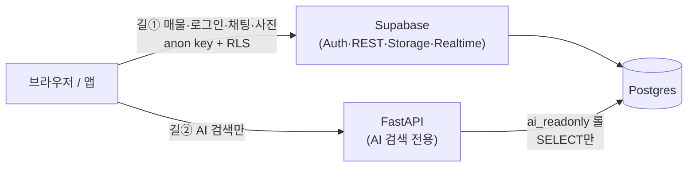
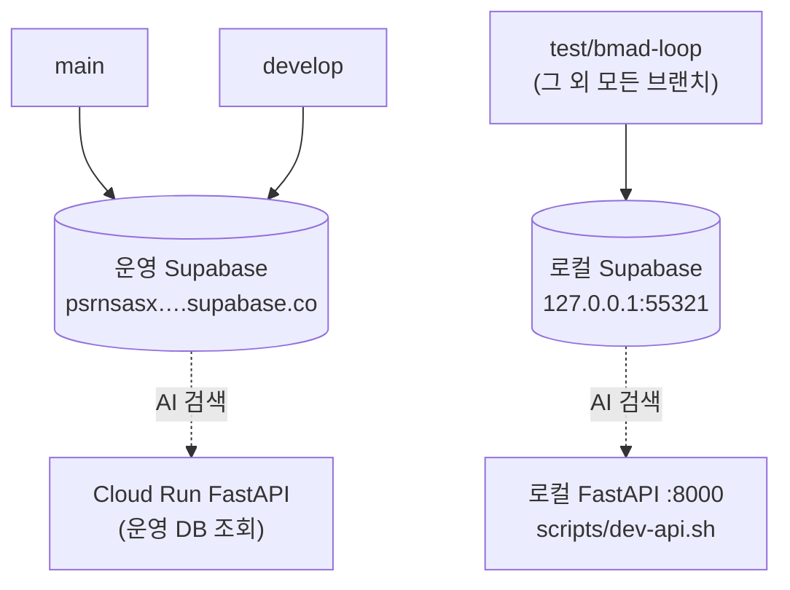
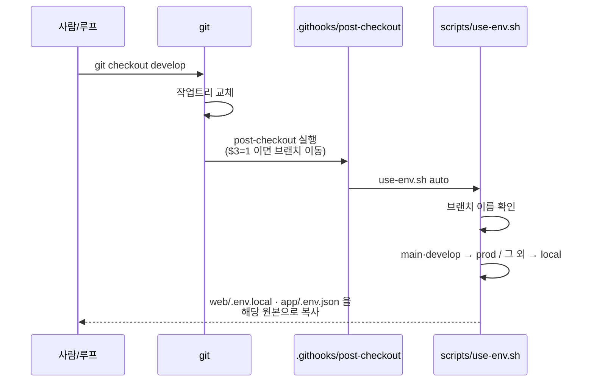

# 로컬 개발 환경 — 브랜치별 DB·백엔드 접근 지도

- **작성:** 2026-07-21 · **대상 독자:** 이 저장소에서 개발하는 사람(사람·에이전트 모두)
- **왜 있나:** 자동 개발 루프가 운영 DB를 건드리지 않게 하려고 로컬 Supabase 스택을 세웠다. 그 결과 **브랜치마다 보는 DB가 달라졌고**, 그 규칙이 어디에 어떻게 박혀 있는지 한 곳에 적어둔다.
- **관련:** 열린 항목은 `docs/tech-debt.md` #105 · 배포 절차는 `docs/deployment-runbook.md`

---

## 1. 먼저 알아야 할 것 — DB로 가는 길은 두 개다

이걸 모르면 뒤 내용이 안 잡힌다. **화면 대부분은 백엔드를 거치지 않는다.**



| | 길 ① 브라우저 → Supabase | 길 ② 브라우저 → FastAPI → Postgres |
|---|---|---|
| **무엇이 쓰나** | 매물 목록·상세, 로그인, 채팅, 사진, 관리자 화면 | **AI 검색(`/ai`)만** |
| **필요한 값** | `SUPABASE_URL`, `ANON_KEY` | 길① 값 + `DATABASE_URL`, `GEMINI_API_KEY` |
| **누가 지키나** | DB의 RLS 정책 | `ai_readonly` 롤(SELECT만) + 토큰 검증(401) |
| **코드 위치** | `web/src/lib/supabase/env.ts` (웹의 단일 진입점) | `web/src/lib/api/aiSearch.ts` → `api/app/` |

> **그래서** `api/.env`가 없어도 개발이 됐던 것이다 — 길②(AI 검색)를 로컬에서 띄우지 않았을 뿐, 길①은 `web/.env.local`만으로 돌아간다.

---

## 2. 브랜치별로 무엇을 보나



| | `main` | `develop` | `test/*` · 그 외 |
|---|---|---|---|
| **Supabase(길①)** | 운영 | 운영 | **로컬 127.0.0.1:55321** |
| **AI 백엔드(길②)** | Cloud Run(운영 DB) | Cloud Run(운영 DB) | **로컬 :8000 → 로컬 DB** |
| **데이터** | 진짜 운영 데이터 | 진짜 운영 데이터 | 운영 복사본(매물 103·사진 181) |
| **망가뜨리면** | 복구 불가 | 복구 불가 | `seed-local.sh` 19초 |

**규칙은 한 줄이다: `main`·`develop`만 운영, 나머지 전부 로컬.**
모르는 브랜치를 로컬로 보내는 이유는 **실수의 방향을 싼 쪽으로 기울이기** 위해서다 — 모르는 브랜치가 운영에 붙는 사고가, 로컬에 붙는 사고보다 훨씬 비싸다.

---

## 3. 브랜치를 바꾸면 무엇이 어떻게 바뀌나

### 바뀌는 값은 딱 2개 파일이다

| 레이어 | 파일 | 들어 있는 값 |
|---|---|---|
| 웹(Next.js) | `web/.env.local` | `NEXT_PUBLIC_SUPABASE_URL`, `ANON_KEY`, `API_BASE_URL` |
| 앱(Flutter) | `app/.env.json` | `SUPABASE_URL`, `SUPABASE_ANON_KEY`, `API_BASE_URL` |

이 두 파일은 **git이 추적하지 않는다**(`.gitignore`의 `.env*`). 그래서 **브랜치를 바꿔도 저절로 바뀌지 않는다** — 이것이 자동화가 필요한 이유다.

### 누가 바꾸나 — 체크아웃 훅



원본 파일 4개(전부 gitignore, 커밋 안 됨):

```
web/.env.dev        →  web/.env.local     (로컬용)
web/.env.prod       →  web/.env.local     (운영용)
app/.env.json.dev   →  app/.env.json      (로컬용)
app/.env.json.prod  →  app/.env.json      (운영용)
```

**마법이 아니라 파일 복사다.** 훅을 켜는 설정은 `git config core.hooksPath .githooks` (이 저장소에 적용됨).
`$3` 값이 `1`(브랜치 이동)일 때만 동작하므로 `git checkout -- 파일하나` 에는 반응하지 않는다.

### 훅이 건드리지 **않는** 것

- **`api/.env`** — `GEMINI_API_KEY`만 들어 있다. 이 키는 로컬·운영이 같으므로 바꿀 이유가 없다.
  로컬 AI 백엔드의 DB 주소는 `scripts/dev-api.sh`가 **실행할 때 OS 환경변수로** 주입한다.
  `pydantic-settings`는 OS 환경변수를 `.env` 파일값보다 우선하므로(실측 확인), 파일에 무엇이 있든 로컬이 이긴다.
- **Vercel·Cloud Run 환경변수** — 배포본은 플랫폼이 값을 주입한다. `.env` 파일은 컨테이너에 들어가지도 않는다(`api/.dockerignore`가 제외).

---

## 4. 로컬에서 띄우는 법

```bash
npx supabase start            # ① Supabase 전체 스택(포트 55321~55324)
bash scripts/seed-local.sh    # ② 데이터 채우기(계정·매물·사진·임베딩) — 19초
cd web && npm run dev         # ③ 웹 (3000, 이미 쓰이면 3001)
bash scripts/dev-api.sh       # ④ AI 검색 백엔드 (8000) — /ai 쓸 때만 필요
```

- 포트를 `55321`대로 옮긴 이유: 이 장비에서 **다른 프로젝트의 Supabase 스택이 54321대를 쓰고 있어** 충돌한다. 둘을 동시에 켤 수 있다.
- `seed-local.sh`는 **DB를 초기화한 뒤 다시 채우는 용도**다. 루프가 `supabase db reset`을 돌려도 이 한 줄이면 복구된다.
- 로컬 계정 비밀번호는 전부 `supabase/.env.seed`의 `SEED_PASSWORD` 하나로 통일돼 있다.

---

## 5. 아직 안 되는 것 (2026-07-21 기준)

| 항목 | 상태 | 왜 |
|---|---|---|
| `main`에서 자동 전환 | ❌ | `main`에 훅 파일이 아직 없다. **병합하면 풀린다**(대장 #105). 지금은 안전한 쪽으로 틀린다 — 운영이어야 할 자리에 로컬이 남을 뿐 |
| `develop`에서 로컬 AI 백엔드 | ❌ | `scripts/dev-api.sh`와 임베딩 자동생성이 아직 `test/bmad-loop`에만 있다. 다음 병합에 따라온다 |
| 지식형 AI 질문 | ❌ | 설계상 그렇다 — 경로B는 **매물을 뜻으로 고르는** 길이지 문서 지식을 답하는 길이 아니다. Epic 13(`13-2`·`13-6`)에서 바뀐다 |

---

## 6. 자주 헷갈리는 것

**Q. 로컬 DB에 `DROP TABLE` 하면 운영도 날아가나?**
아니다. 완전히 다른 DB다. `supabase db reset` + `seed-local.sh`로 19초면 복구된다.

**Q. `develop`에서 개발하면 운영 데이터를 건드리는 건가?**
**읽기는 운영을 본다.** 매물을 등록·삭제하면 **진짜 운영 데이터가 바뀐다.** 실험은 `test/*` 브랜치에서 하라.

**Q. `.env` 파일은 운영에서도 쓰나?**
아니다. 배포본은 Vercel·Cloud Run이 환경변수를 직접 주입한다. `api/.dockerignore`가 `.env`를 이미지에서 제외한다. `.env`는 **개발 장비에서 값을 주는 방법**일 뿐이다.

**Q. 임베딩 값이 운영과 다른데 괜찮나?**
괜찮다. 옮긴 게 아니라 **다시 계산**한 것이라 숫자는 다르지만 의미검색 품질은 동등하다. 벡터는 행당 9.5KB라 스냅샷에 넣지 않았다.
